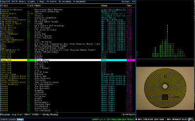
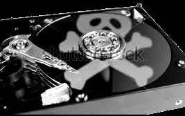

Shell script to display cover art of currently playing track in mpd, using only offline sources.

It extracts embedded images using ffmpeg.  If no image is found, it uses an image file from the same directory as the track.  If still no images is found, it uses a default image. (Todo: emboss track title onto default image using imagemagick)

The script places the image in tmp/cover.jpg, which can then be viewed with image viewer [imv](https://github.com/eXeC64/imv) which will automatically update the displayed image when it changes.

Here is imv, running together with ncmpcpp and nausea (visualiser) in a split screen with i3 window manager

The default image, when nothing else is found.
